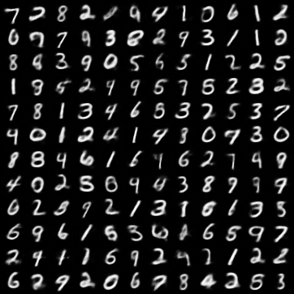

## Variational Autoencoder
This repository contains code and ideas about Variational Autoencoders. 
The current code contains an implementation of Variational Bayesian Autoencoders and its deviations, such as  β-VAE or σ-VAE. As a Dataset I have used the MNIST and CelebA Dataset.

Please refer to the following docs:
- Summary report of VAEs: https://github.com/robinmittas/variational-autoencoder/blob/main/Variational_Autoencoder%20Robin%20Mittas.pdf
- Slides to my presentation about VAEs: https://github.com/robinmittas/variational-autoencoder/blob/main/presentation.pdf
- Short handout with the most important information of my talk: https://github.com/robinmittas/variational-autoencoder/blob/main/Handout.pdf

### Work in Progress
The code needs to be cleaned, as well as the further implementation of some LadderVAE/ Inverse autoregressive Flows is on my Todo List.

## Samples/ reconstructions for β-VAE/ disentangled VAE on CELEBA Dataset
### 1. β-VAE (β=20, latent_dimension=12)

Sample:


Reconstructions:


### 2. β-VAE (β=20, latent_dimension=128)

Sample:


Reconstructions:


### 3. β-VAE (β=20, latent_dimension=256)

Sample:


Reconstructions:


## GIF Latent Traversals
Following GIF comes from a β-VAE with Latent dimension 12. Each image represents one decoded Vector $z \in \mathbb{R}^{12}$ where each entry is standard normal, $z_i \thicksim \mathcal{N}(0,1) \ \forall i \in \{1,...10\}$.
Each row represents one latent dimension $i \in \{1,...10\}$ (last two latent dimensions are ignored due to image size) when adding small deltas to one latent dimension at a time.


## Following samples were drawn from the latent spaces with the MNIST Dataset
### 1. Standard Linear VAE


### 2. Standard Convolutional VAE


### 3. β-VAE (β=2)



### 4. β-VAE (β=1e-1)


### 5. σ-VAE


The following image illustrates the Latent Space distribution for a σ-VAE with 2-dimensional Latent Space. 
The image on the top right is a decoded Image of the sample (-1,1), the top right displays the decoded Image of the latent vector (1,1).


### How to use this repository:
1. Create venv

First of all we create a virtual Environment, activate it and install the requirements. If you use Pycharm you cann also add an interpreter, select "virtual environment" and create it. Afterwards you just need to execute the last two commands.
```
cd variational-autoencoder
python -m venv venv/ 
venv/Scripts/activate.bat # For windows users: venv\Scripts\activate.bat (in anaconda prompt)
python -m pip install -r requirements.txt
```
Depending on your IDE you can select the just created venv as Python Interpreter.

2. Tensorboard
```
cd variational-autoencoder
tensorboard --logdir=logs_tensorboard
#### or if we use Ligtning Module
tensorboard --logdir=logs/Model/version_xy  
```

### Sources
The code and ideas come from different sources which are listed here and on the PDF slides:

https://github.com/AntixK/PyTorch-VAE

https://github.com/orybkin/sigma-vae-pytorch

https://arxiv.org/pdf/1312.6114.pdf

https://arxiv.org/pdf/2101.06772.pdf

https://github.com/YannDubs/disentangling-vae
