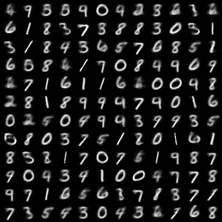
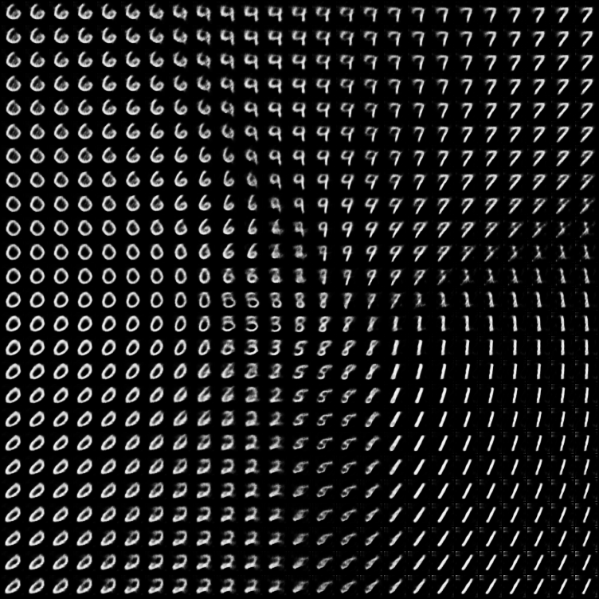

## Variational Autoencoder
This repository contains code and ideas about Variational Autoencoders. 
The current code contains an implementation of Variational Bayesian Autoencoders and its deviations, such as  β-VAE or σ-VAE. All ideas and mathematical foundations will be published in slides and in a report.
As a Dataset I have used the MNIST Dataset 

### Following samples were drawn from the latent spaces
1. Standard Linear VAE



2. Standard Convolutional VAE


3. β-VAE (β=2)


4. β-VAE (β=1e-1)


5. σ-VAE


The following image illustrates the Latent Space distribution for a σ-VAE with 2-dimensional Latent Space. 
The image on the top right is a decoded Image of the sample (-1,1), the top right displays the decoded Image of the latent vector (1,1).



### How to use this repository:
1. Create venv

First of all we create a virtual Environment, activate it and install the requirements. If you use Pycharm you cann also add an interpreter, select "virtual environment" and create it. Afterwards you just need to execute the last two commands.
```
cd variational-autoencoder
python -m venv venv/ 
venv/Scripts/activate.bat # For windows users: venv\Scripts\activate.bat (in anaconda prompt)
python -m pip install -r requirements.txt
```
Depending on your IDE you can select the just created venv as Python Interpreter.

2. Tensorboard
```
cd variational-autoencoder
tensorboard --logdir=logs_tensorboard
#### or if we use Ligtning Module
tensorboard --logdir=logs/Model/version_xy  
```

### Sources
The code and ideas come from different sources which are listed here and on the PDF slides:

https://github.com/AntixK/PyTorch-VAE

https://github.com/orybkin/sigma-vae-pytorch

https://arxiv.org/pdf/1312.6114.pdf

https://arxiv.org/pdf/2101.06772.pdf